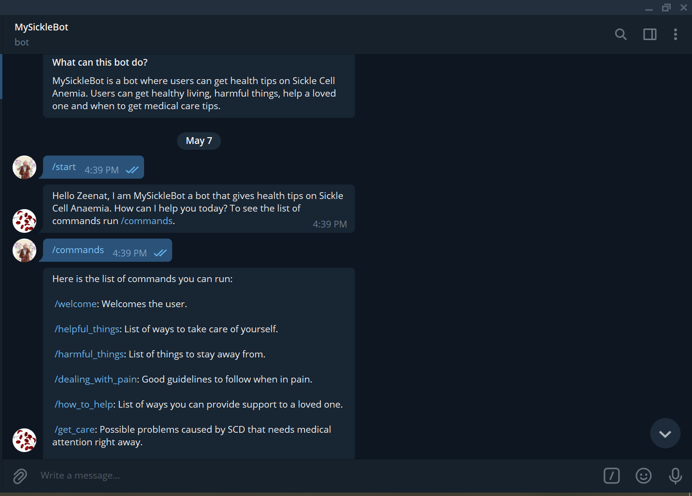

# Telegram-Bot-MySickleBot

> Ruby Capstone Project (MySickleBot - A Telegram Bot)
 A simple bot that gives health tips on Sickle Cell Anaemia, built following the original project specifications from [Microverse Ruby Capstone Project - Build your bot](https://www.notion.so/Build-your-own-bot-ebd0d7ac5da240e5987720bdc83f38fa)

MySickleBot is a telegram bot where users can get health tips on Sickle Cell Anaemia. Users can get healthy living, harmful things, help a loved one and when to get medical care tips. The bot scrapes health tips from the [webmd](https://www.webmd.com/a-to-z-guides/living-with-sickle-cell) website. The bot was built to give quick health tips on Sickle Cell Anaemia.

## Built With

- Ruby

## How MySickleBot works

- Launch the Telegram app
- Search for @MySickleBot
- Click start to get started
- Run `/commands` to get the list of commands
- Select the type of health tip you want to read

## Getting Started

To get a local copy up and running follow these simple example steps.

### Prerequisites

- Web browser (e.g. Google Chrome or Firefox)
- Code Editor (e.g. Vscode or Atom)
- Telegram app

### Setup

- Copy this link [Telegram-Bot-MySickleBot](https://github.com/ZeenatLawal/Telegram-Bot-MySickleBot.git)
- Open your terminal or command line in the folder you want the project to be
- Run the command git clone with the link you copied above `git clone https://github.com/ZeenatLawal/Telegram-Bot-MySickleBot.git`
- Once you have a local copy, run `bundle install` to install all gemfiles in the directory
- Talk to @BotFather on Telegram to create your bot
- Get your token from the BotFather and put it in the code
- Run bin/main.rb to get your bot up and running

### Run tests

- Run the following command `bundle exec rspec` or `rspec` in the terminal to run all tests in the directory

## Author

👤 **Zeenat Lawal**

- GitHub: [@ZeenatLawal](https://github.com/ZeenatLawal)
- Twitter: [@lawal_zeenat](https://twitter.com/lawal_zeenat)
- LinkedIn: [Zeenat Lawal](https://www.linkedin.com/in/zeenatlawal/)

## 🤝 Contributing

Contributions, issues, and feature requests are welcome!

Feel free to check the [issues page](https://github.com/ZeenatLawal/Telegram-Bot-MySickleBot/issues/).

## Show your support

Give a ⭐️ if you like this project!

## Acknowledgments

- [Safa Aballagh](https://github.com/safafa) and [Francis Uloko](https://github.com/francisuloko)
- Coding Partner [Peter MX](https://github.com/blakbox23)
- My StandUp Team
- Inspiration got from all Sickle cell warriors (Myself included:smile:)

## 📝 License

This project is [MIT](https://github.com/git/git-scm.com/blob/main/MIT-LICENSE.txt) licensed.